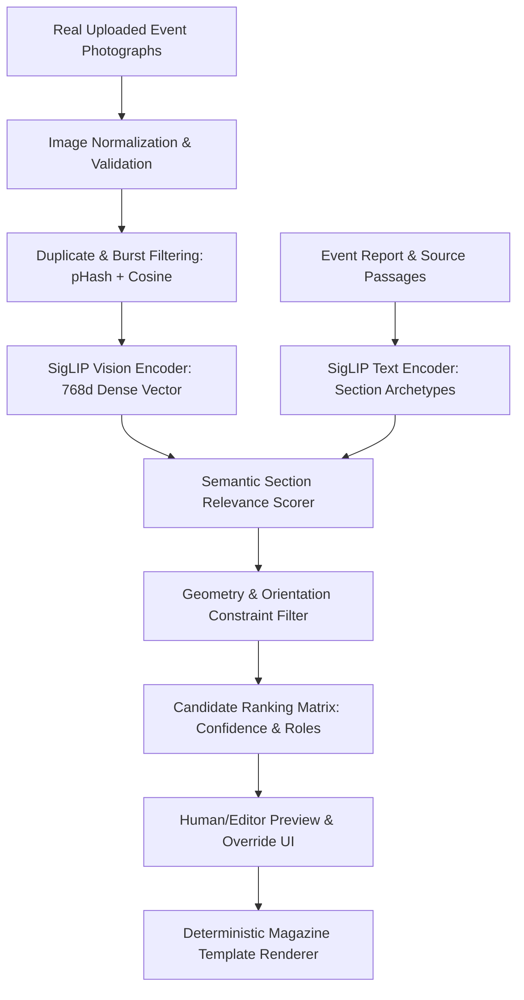

# Multi-Modal Photo Matching Architecture & Caption Boundary Specification

Evaluation Specification for SigLIP Multimodal Image Intelligence within the SIET Magazine Editorial Platform.

---

## 1. Product Principle: Prioritizing Real User-Uploaded Photographs

> [!IMPORTANT]
> **Real User-Uploaded Event Photographs Are Sacrosanct.**
> An AI image generation model must **never** synthesize replacement faces, students, dignitaries, or fake campus activities simply because a slot in a magazine template is empty or because generative models are available. Real photos document authentic institutional heritage. SigLIP is employed exclusively for **semantic comprehension, section relevance scoring, and layout matching** of authentic photographs.

---

## 2. Proposed Production Photo Matching Pipeline



### Step-by-Step Processing Flow

1. **Image Ingestion & Normalization**:
   - Validate image format (JPEG, PNG, WebP).
   - Read EXIF metadata to auto-orient rotated photographs.
   - Extract dimensions and compute aspect ratios (landscape `>1.2`, portrait `<0.85`, square `0.85–1.2`).
   - Assess resolution: flag low-resolution assets (`<800px` width) with a warning badge for print layouts.

2. **Deduplication & Burst Shot Pruning**:
   - Compute perceptual hash (`pHash`).
   - Flag near-duplicate burst photographs taken within seconds of each other (e.g., pHash Hamming distance `<5` or SigLIP cosine similarity `>0.96`).
   - Pick the sharpest photo in the burst cluster (via Laplacian variance focus metric).

3. **Multi-Modal Embedding**:
   - Pass normalized image through `SigLIP Vision Encoder` (`google/siglip-base-patch16-224` or `384`) producing a dense 768-dimensional normalized L2 vector.
   - Text passages (issue theme, section headings, department name, and candidate slot directives) are encoded into the identical 768-dimensional vector space using the `SigLIP Text Encoder`.

4. **Candidate Section Scoring & Role Matching**:
   - Template slots have explicit semantic and geometric requirements:
     - **Cover Hero Banner**: Requires high-energy visual anchor, landscape `16:9` or `3:2`, thematic match with main event headline.
     - **Lead Writeup Feature**: Shows core action (e.g., keynote speaker, active demonstration), landscape or portrait.
     - **Award Showcase**: Matches trophy, podium, medal, certificate presentations.
     - **Gallery Grid**: Accommodates candid student interactions, crowd photos, secondary demonstrations.
   - The match score is computed as:
     $$\text{Score} = w_{\text{semantic}} \cdot (\vec{v}_{\text{image}} \cdot \vec{v}_{\text{section}}) + w_{\text{geo}} \cdot \text{AspectCompatibility} - \text{Penalty}_{\text{low\_res}}$$

5. **Human / Editor Confirmation**:
   - The admin UI displays the AI-ranked candidate photo for each template region with an overlay confidence score and the top-3 alternative choices.
   - One-click drag-and-drop swap enables the editorial team to override any automatic assignment before final PDF compilation.

---

## 3. Caption Boundary: Division of Responsibilities

Strict architectural boundary between visual comprehension and factual editorial writing:

| Capability | SigLIP Model | Qwen3 14B Model |
| :--- | :--- | :--- |
| **Primary Domain** | Visual embedding & semantic classification | Editorial intelligence & textual generation |
| **Input** | Raw pixels (RGB image) | Text prompt, RAG source passages, SigLIP labels |
| **Output** | 768d vector, cosine similarity scores | Grounded publication-ready editorial prose |
| **Role in Photo Workflow** | Detects category (e.g. "award ceremony on stage") | Writes caption: *"Dr. Ramanathan presenting award to Team RoverTech"* |
| **Hallucination Risk** | Cannot hallucinate text (only outputs embeddings) | Subject to hallucination without strict grounding |
| **Grounding Mandate** | N/A | **STRICT**: Uses only source document facts; never invents names or dates |

### Strict Grounding Rules for Caption Generation
1. SigLIP informs Qwen of the visual semantic context (e.g., `visual_context: "award ceremony on stage with certificate"`).
2. Qwen cross-references this visual context with the verified RAG event notes:
   - If the event report mentions *"Team RoverTech received 1st prize from Dr. Arvind Ramanathan"*, Qwen connects the award visual to Team RoverTech.
   - If the report does **not** specify who is pictured in a generic crowd photo, Qwen is strictly instructed:
     *"Missing specific individual identities must be written generally (e.g., 'Student participants attending the technical session'). Never invent names, dates, organizations, or titles."*

---

## 4. Embedding Cache Architecture

To prevent redundant GPU embedding passes whenever templates or draft issues are re-rendered:

```text
Cache Key = SHA256( image_binary_hash + ":" + model_checkpoint_id + ":" + preprocess_version )
```

### Cache Key Components
- `image_binary_hash`: SHA-256 hex digest of the raw image bytes (detects byte-level modifications).
- `model_checkpoint_id`: E.g., `google-siglip-base-patch16-224-fp16` (automatically invalidates cache if model is upgraded to `patch16-384` or fine-tuned).
- `preprocess_version`: E.g., `v1-bicubic-norm224` (invalidates cache if resizing, cropping, or color normalization algorithms change).

### Storage Recommendation
- Store vectors in `PostgreSQL` with `pgvector` (`vector(768)`) or an in-memory key-value cache (Redis / file-based pickle cache).
- Read-heavy, write-once: An image is embedded exactly once on initial upload and reused across drafts, galleries, and archives.

---

## 5. Quality & Failure Analysis

SigLIP performs exceptionally well on open-vocabulary semantic categorization, but exhibits known failure boundaries that must be compensated for by pipeline design:

1. **Identity & Facial Attribution**:
   - *Limitation*: SigLIP cannot recognize specific individuals (e.g., distinguishing Student A from Student B).
   - *Mitigation*: Identity attribution is delegated strictly to RAG document metadata and human editor confirmation.
2. **Generic Group Photos**:
   - *Limitation*: Posed group photos across different departments look virtually identical in pixel space (two rows of people smiling in front of a building).
   - *Mitigation*: Inject metadata constraints (department ID, event date, upload batch timestamp) into the ranking algorithm.
3. **Text-Heavy Posters & Backdrops**:
   - *Limitation*: Patch-16 at 224x224 resolution downsamples small textual details on stage banners.
   - *Mitigation*: For reading banner text, OCR or higher-resolution 384x384 processing should supplement classification.
4. **Low Lighting & Motion Blur**:
   - *Limitation*: Degraded mobile phone photos in auditorium darkness reduce cosine similarity margins.
   - *Mitigation*: Calculate Laplacian blur metrics during ingestion; prompt editor to supply a clearer photograph.
